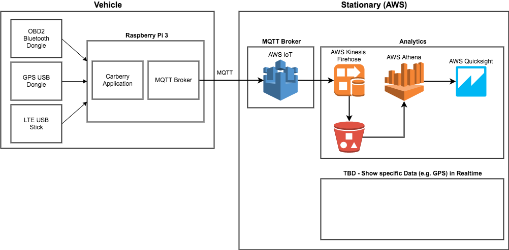

**WORK IN PROGRESS**

# IoT POC

Idea: Reliably collect and transfer data from a vehicle using cheap consumer electronics and standard technologies. Serving important data in real time and running data analytics on collected data.

Motivation: Proof concept and getting in touch with new technologies and concepts.

Used technologies:
* OBD2
* GPS
* MQTT
* AWS (IoT Core, ...)

Used hardware:
* Raspberry Pi 3
* Huawei e3372 LTE USB Stick
* Exza HHOBD Bluetooth Dongle
* [GPS Receiver]

Used software: 
* Vehicle
    * Raspberry Pi 3 with jessie
    * Python 3.4.2
        * paho-mqtt
        * RxPy
        * [Python OBD2 module]
        * [Python GPS module]
    * mosquitto (MQTT broker)
* Stationary
    * AWS IoT Core, Rules
    * AWS Firehose
    * ...

### Overview



## Carberry - Setting Up Raspberry

### Install Huawei e3372 LTE Stick

Hint: The USB Stick i'm using is running with the Huawei HiLink firmware, which connects via eth1 and not as regular USB modem. This means there is some kind of NATting involved via the stick and the device (the stick is connected to) is getting an IP from a private range (192.168.x.x) and not directly the IP address assigned by the network operator. This is not an issue for my current setup, as i'm only using outgoing connection. 

By default the stick is recognized as usb-storage device and has to be switched to Modem mode, each time the Raspberry was powered off.

Manually switch to modem mode: `sudo usb_modeswitch -v 12d1 -p 1f01 -M '55534243123456780000000000000a11062000000000000100000000000000'`

To automatically switch the stick to Modem mode, add: 
```
ATTRS{idVendor}=="12d1", ATTRS{idProduct}=="1f01", RUN+="/usr/sbin/usb_modeswitch -v 12d1 -p 1f01 -M '55534243123456780000000000000a11062000000000000100000000000000'"
```
to the file `/lib/udev/rules.d/40-usb_modeswitch.rules`.

### Connect OBD2 Bluetooth Dongle

Start `bluetoothctl`, and enter the following commands:
1. agent on
2. pairable on
3. scan on
*Wait until Bluetooth Adapter has been found*
4. pair [MAC-Adresse]
*Wait for PIN prompt*
5. trust [MAC-Adresse]
6. connect [MAC-Adresse]
*After that you should see a NotAvailable error message*
7. info [MAC-Adresse]
Will display a `connected: no`

Now the serial port can be configured (https://bbs.archlinux.org/viewtopic.php?id=178011):
1. sudo modprobe rfcomm
2. sudo rfcomm bind rfcomm0 [MAC-Adresse]
3. ls /dev |grep rfcomm
*Should display `rfcomm0`*
    
### Test OBD2 Bluetooth Dongle

### Install MQTT Broker mosquitto

Run the following command to install mosquitto: `sudo apt-get install -y mosquitto mosquitto-clients`

After the installation the MQTT broker should be running.

To validate, if mosquitto is running execute `mosquitto_sub -t "#"` in one terminal to subscribe to all topics. And in another terminal run `mosquitto_pub -t "greetings" -m "hello"`. After publishing the message `hello`should appear in the first terminal.

## Install Carberry application software

### Installation steps

1. Install Python3: `sudo apt-get install python3 python3-pip`
2. Install git: `sudo apt-get install git`
3. Change directory: `cd /opt`
3. Clone this repository: `git clone https://github.com/mtiews/carberry.git`
4. Change into cloned directory: `cd carberry`
5. Install required Python libraries: `sudo pip3 install -r requirements.txt`

### Run Carberry as service using systemd

1. Create a user: `sudo useradd -r -s /bin/false carberry`
2. Create a config file for systemd: `sudo nano /etc/systemd/system/carberry.service`
3. Paste the following content into the file:
```
[Unit]
Description=Carberry Application Service
After=syslog.target

[Service]
Type=simple
User=carberry
Group=carberry
WorkingDirectory=/opt/carberry
ExecStart=/opt/carberry/main.py
SyslogIdentifier=carberry
StandardOutput=syslog
StandardError=syslog
Restart=always
RestartSec=3

[Install]
WantedBy=multi-user.target
```
4. Reload systemd configuration: `sudo systemctl daemon-reload`
5. Enable service: `sudo systemctl enable carberry.service`

Log outputs are written to `/var/log/syslog`.

To view the logs run `sudo journalctl -u carberry` or `sudo journalctl -f -u carberry` to follow the logs.

## Misc

### MQTT on MacOS
Install mosquitto via Homebrew: `brew install mosquitto`

Run locally installed mosquitto: `/usr/local/sbin/mosquitto -c /usr/local/etc/mosquitto/mosquitto.conf`

Listen for all messages: ``mosquitto_sub -t "#"``

### Drawings

https://www.draw.io/

### Commands

Tunnel/SOCKS Proxy via ssh: `ssh -D 3333 user@host`

Create requirements list for Python: `pip3 freeze > requirements.txt`

